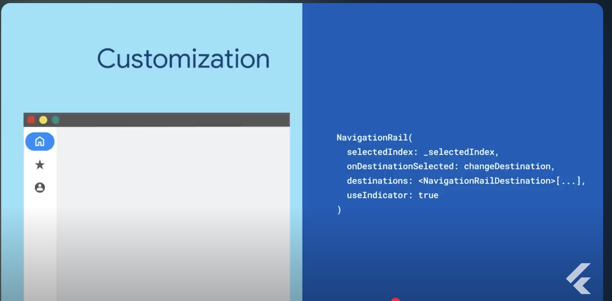
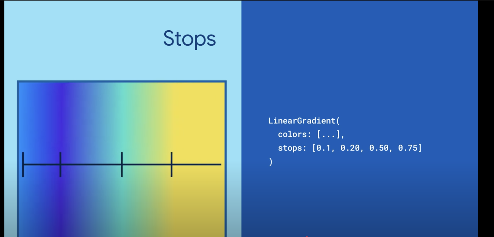

# *****************************************FLUTTER*****************************************

## COMMON CLI COMMANDS

-flutter pub get
-flutter run
-flutter clean
-flutter doctor
-flutter pub cache repair

### WIDGET TYPES:
- A view model is a Dart class responsible for handling UI logic.View models take domain data models as input and expose that data as UI state to their corresponding views
<b>view models need to tell Flutter to re-render views when the data layer provides a new state by extending ChangeNotifier or some other state management framework</b>

- 

### WIDGET DATA FLOW:       ViewModel <- Repository
1. New state is provided to the view model from a Repository.
2. The view model updates its UI state to reflect the new data.
3. ViewModel.notifyListeners is called, alerting the View of new UI State.
4. The view (widget) re-renders.

### State management
Flutter is declarative.
UI = f(application state)
Two types of state:
UI(Local) state: Stateful widgets. Ephemeral(USE SETSTATE or useState hook
App State: shared across parts of app. User preferences, carts, logins...etc 
USE PROVIDER, RIVERPOD, VALUENOTIFIER & INHERITEDNOTIFIER, INHERITED WIDGET & INHERITED MODEL

USE Cases:
StatefulWidget: Widget needs own internal EPHEMERAL state

I have a stateless type widget(Stateless, HookConsumer, Consumer)
    - useState for NON UI REBUILDING CHANGES.
        - i.e. I have a dialog box where the user enters data and we need to temporarily save that data until the submit button is clicked. 

VIEW HIERARCHY:
- Screen
    - View/s
        - ViewModel

### FILE STRUCTURE
lib
├─┬─ ui
│ ├─┬─ core
│ │ ├─┬─ ui
│ │ │ └─── <shared widgets>
│ │ └─── themes
│ └─┬─ <FEATURE NAME>
│   ├─┬─ view_model
│   │ └─── <view_model class>.dart
│   └─┬─ widgets
│     ├── <feature name>_screen.dart
│     └── <other widgets>
├─┬─ domain
│ └─┬─ models
│   └─── <model name>.dart
├─┬─ data
│ ├─┬─ repositories
│ │ └─── <repository class>.dart
│ ├─┬─ services
│ │ └─── <service class>.dart
│ └─┬─ model
│   └─── <api model class>.dart
├─── config
├─── utils
├─── routing
├─── main_staging.dart
├─── main_development.dart
└─── main.dart

// The test folder contains unit and widget tests
test
├─── data
├─── domain
├─── ui
└─── utils

// The testing folder contains mocks other classes need to execute tests
testing
├─── fakes
└─── models
pubspec.yaml - Dependency Management
analysis_options.yaml - Linting
### ARCHITECTURE

### Widget lifecycle
#### Constructs widget       sets state    builds     updates       rebuilds   releases resources 
####                                                                           though widget may 
####                                                                            be added back
#### WidgetConstructor() -> initState() -> build() -> setState() -> build() -> deactivate()   -> dispose()

### Widget lifecycle methods
createState(): This method is required and creates a State object for the widget. It holds all the mutable state for that widget. 
The State object is associated with the BuildContext by setting the mounted property to true.

initState(): This method is automatically called after the widget is inserted into the tree. 
It is executed only once when the state object is created for the first time. Use this method for initializing variables and subscribing to data sources.

didChangeDependencies(): The framework calls this method immediately after initState(). 
It is also called when an object that the widget depends on changes. Use this method to handle changes in dependencies, but it is rarely needed as the build method is always called after this.

build(): This method is required and is called many times during the lifecycle. 
It is called after didChangeDependencies() and whenever the widget needs to be rebuilt. Update the UI of the widget in this method.

didUpdateWidget(): This method is called when the parent widget changes its configuration 
and requires the widget to rebuild. It receives the old widget as an argument, allowing you to compare it with the new widget. 
Use this method to handle changes in the widget's configuration.

setState(): The setState() method notifies the framework that the internal state of the widget has changed and needs to be updated. 
Whenever you modify the state, use this method to trigger a rebuild of the widget's UI.

deactivate(): This method is called when the widget is removed from the widget tree but can be reinserted before the current frame changes are finished. 
Use this method for any cleanup or pausing ongoing operations.

dispose(): This method is called when the State object is permanently removed from the widget tree. Use this method for cleaning up resources, such as data listeners or closing connections.

### FORM KEY
So it doesn't get rebuilt:
final formKey = useMemoized(() => GlobalKey<FormState>())

### ADDING PROJECT TO FIREBASE
#### Go to console.firebase.google.com and sign in(if necessary)
#### Create app

#### Android
#### In the IDE go to android manifest and copy package name

#### IOS:
Go to project.pbxproj and copy the BUNDLE_IDENTIFIER

#### HOSTING WITH FIREBASE:
*** ALL COMMANDS ARE RUN FROM PROJECT ROOT. WHERE THE PUBSPEC.YAML RESIDES ***
1. Install firebase CLI:
npm install -g firebase-tools
2. Login to firebase from command line:
firebase login
3. (OPTIONAL) Enable experiemental web frameworks
firebase experiments:enable webframeworks
4. Build/Enable hosting
firebase init hosting
Follow prompts

You will be given a URL for accessing your URL

### STREAMS AND ASYNC

Future: Returns single value

Stream: Multiple Events over time
Properties
    -.listen instead of async/await
    -yield: Current state of function is saved. Unlike RETURN, yield doesn't stop function execution
Widgets
    -StreamController: Create and Manage Stream
        - Call controller outside
        - Close controller!!
        - .listen (methodName.listen)
        - 

async*: Asynchronous generator

## DATA STRUCTURES
### RECORDS
Custom types w/o defining a class
TYPE SAFE!!!
({String name, int age, String last, List<String> list}) customType() {
    return ('str', 1, 'str', ['asdf', 'asdf'])
}

void main() {
    final (name, age, address) = customType();
}

### PATTERNS
 

### HOOKS
useState (USE INSTEAD OF SETSTATE)

useEffect
w/empty array only initializes 1
w/non-empty array runs 1+n
### String extensions - 
Syntax:
extension ExtentionName on String {
    String removeLetter(String letter) {
        letter.replaceAll()
    }
}

### WIDGET CHEAT SHEET:
SingleChildScrollview : Use when a non ListView widget can expand offscreen, such as an InputForm
CircleAvatar

#### NAVIGATION

 *Web*
 NavigationRail: Web substitute for bottom navigation bar which is to wide on Web app.
 

 *Styling and Animation*
 LinearGradient: Creates linear gradient styling for widget
 

Text
DON'T HAVE TO WORRY ABOUT DISPOSING 
finale inputController = useTextEditingController();

